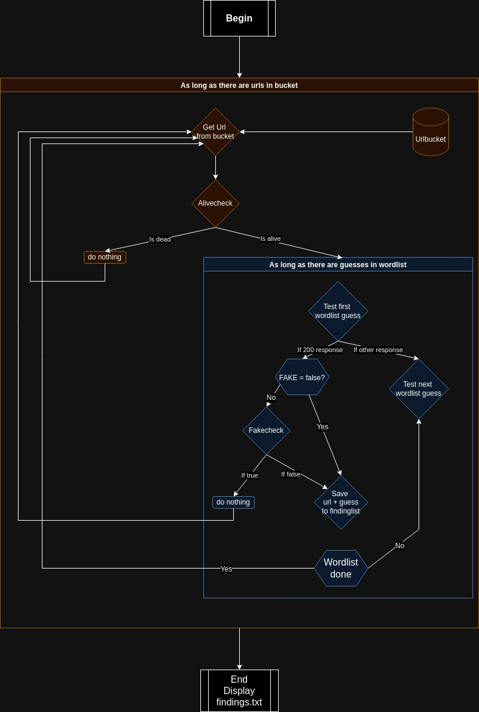

# WordPress Config Finder
The WordPress Config Finder is a Python script that will find common backup files for wp-config.php files. 
It utilizes tools like curl and requests to check the response of the URLs and perform additional actions to analyze the results.

## Features
- Check the response code of URLs using curl and requests
- Performs a check if the WordPress site scanned utilizes plugins or redirects to always return a 200 response code
- Scan for specific URLs based on a wordlist.txt and a path_list-list in the process_website() function
- Run multiple checks concurrently using threadpool execution
- Save the findings to a file for further analysis

## Process flow


## Prerequisites
- Python 3.x
- requests library
- curl command-line tool

## Installation
1. Clone the repository to your local machine:
   ```bash
    git clone https://github.com/your-username/url-check-script.git
    ```
2. Navigate to the project directory:
    ```bash
    cd wp-config-finder
    ```
3. Install the required Python dependencies using pip:
    ```bash
    pip install -r requirements.txt
    ```

## Usage
The script can be run with the following command:
```bash
python main.py -u <url>
```
or
```bash
python main.py -l <list_file>
```
Replace <url> with the single URL you want to check, or <list_file> with the path to a file containing the list of URLs to check (one URL per line).

## Command-line Arguments
- ```-u```, ```--url```: The single URL to check. Example ```-u vulnwp.com```
- ```-l```, ```--list```: The path to a file containing the list of URLs to check. ```-l urls.txt```

## Output
The script will provide detailed output during the execution, including the status codes of the HTTP responses and any findings discovered during the checks. If any URLs match the criteria, they will be saved to a file named findings.txt.

## Contributing
Contributions are welcome! If you have any improvements or additional features to suggest, please create a pull request or open an issue.